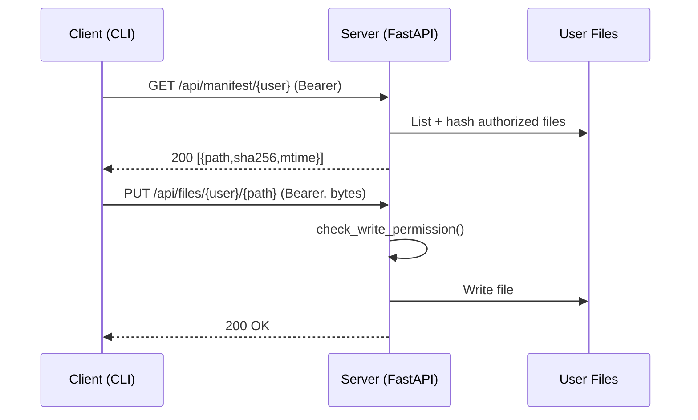

# Server Architecture

FastAPI application providing OAuth and HTTP sync APIs. See `server/`.

Deployment details: see `docs/server-deployment.md`.

## App & Modules
- `app.py` — FastAPI app, CORS, global error handler, includes routers.
- `routes/oauth.py` — `/login`, `/callback`, `/refresh` Google OAuth flows (env: `GOOGLE_CLIENT_ID/SECRET`, `SERVER_BASE_URL`).
- `routes/manifest.py` — `GET /api/manifest/{user}`: returns authorized file list with `{path, sha256, size, mtime}`.
- `routes/files.py` — `GET/PUT /api/files/{user}/{path}`: download/upload with authz checks, path sanitization; special handling for `authz`.
- `routes/keys.py` — `GET /api/keys/{user}`: public endpoint returning user’s X25519 public key.
- `routes/friends.py` — friend request management: create, accept; writes request files into recipient’s system folder.
- `dependencies.py` — `get_current_user` reads `Authorization: Bearer <id_token>` and validates.
- `authz.py` — storage helpers (`get_user_dir`) and ACL enforcement (`check_read_permission`, `check_write_permission`, `validate_authz`).

## Storage Model (server side)
- Per user root: `get_user_dir(email)`
  - `files/` — the mounted/synced tree visible via HTTP.
  - Friend request files are written to: `files/claudeconnect/with-claudeconnect-io/`.

## Request Flow (examples)

## Security
- JWT required for `/api/*` except `/api/keys/*` (public). OAuth via `/login` → `/callback` issues `id_token` to client.
- All file ops validate `..` and force relative paths inside `files/` using `Path.resolve().relative_to(...)`.
- Authz enforcement is path‑scoped; owner can always write. `authz` updates are owner‑only and validated via `validate_authz()`.

## Friend Requests
- `POST /api/friend-request` with JSON: `{to, public_key?, encrypted_master_key?}`
  - Server writes `friend-request-<from>.md` into recipient’s `files/claudeconnect/with-claudeconnect-io/`.
- `POST /api/accept-friend` deletes the pending request file and returns content for the client to extract keys.
